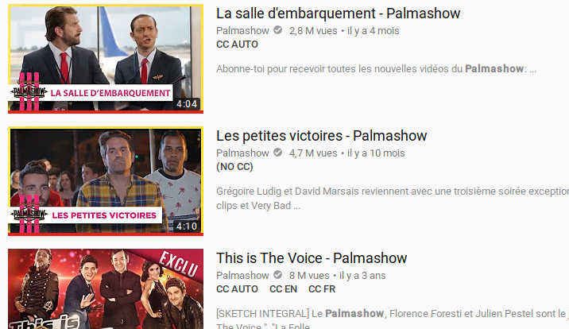

## Youtube caption indicator

Ever wondered if a YouTube video is subtitled in your language, without having to open it ?
  
Youtube caption indicator adds language-specific closed caption indicators below the description of each video among Youtube search results and "similar videos" panels. 

## How to use

Fill your YouTube API key in `youtube-caption-indicator.js`.
Run `bower install`.

### Setup in Chrome

Enable developer options in Chrome's extension page, click on "Load unpacked extension" and select the project's directory.

### Setup in Greasemonkey/Tapermonkey

Just import the script.
