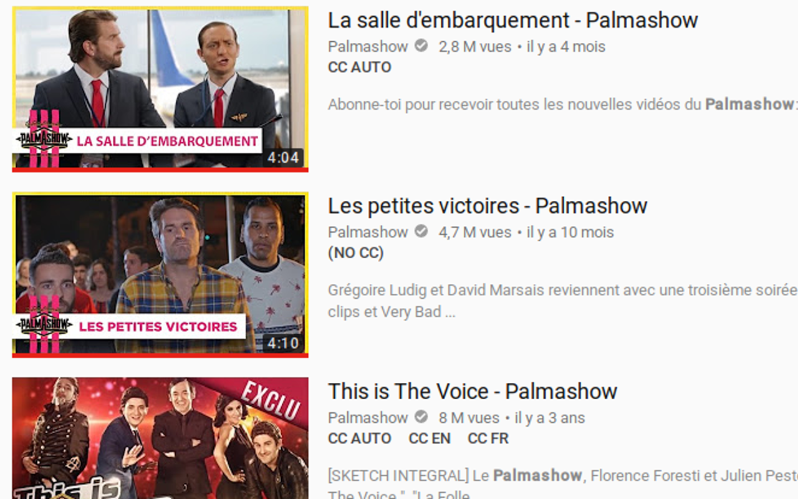

## Youtube caption indicator

Ever wondered if a YouTube video is subtitled in your language, without having to open it ?
  
Youtube caption indicator adds language-specific closed caption indicators below the description of each video among Youtube search results and "similar videos" panels. 

## Build

Create a file named api_key at the root of the project and fill it with your YouTube API key.
Run `bower install`, then build the project with `sh pack.sh`.

### Install on Chrome

Enable developer options in Chrome's extension page, click on "Load unpacked extension" and select the project's `build` directory.

### Install on Firefox

Go to [about:addons](about:addons) and import the extension from the `build` directory.

### Install on Greasemonkey/Tapermonkey

Just import the script from the `build` directory.
